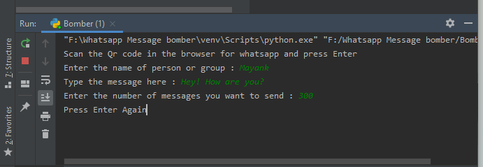

# Whatsapp_Message_bomber
Using this Script,  you can send bulk messages to your contacts.

# Dependencies
selenium 3.141.0
ChromiumDriver.exe

# Usage
Copy the repository into any folder of your computer. Open the project in any IDE. Run the Bomber.py or Multi_user_bomber.py as
per your choice. After running, browser window will open up. Scan the whatsapp QR code there and after it fill the neccesary information
in the Running Console as shown in the screenshots. Please read the text below the "Attention" heading too.

# Attention
The script has been tested on Chrome Browser version 81.0.4044.92. Make sure you have Chrome browser insatlled in your computer having
the same or nearly same version.

# Disclaimer
This script is only for educational and entertainment purpose. Don't use it to harm anyone.

# Thank You..!!!
